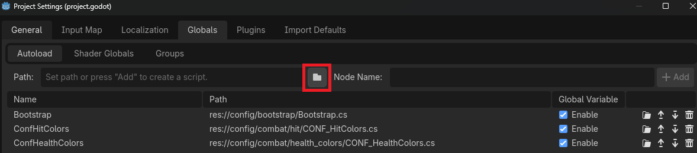

# (Tra) Godot User Settings

[](https://lekloono.github.io/TraGUS/)  

Tragus is a neat piercing, but now, its is also an easy to use plugin to handle user-settings save, load, runtime edit, and easy UI-bindings.

- [(Tra) Godot User Settings](#tra-godot-user-settings)
  - [Features overview](#features-overview)
- [By example](#by-example)
- [Quick workflow overview](#quick-workflow-overview)
  - [User configuration file](#user-configuration-file)
  - [Default configuration file](#default-configuration-file)
  - [Creating user settings](#creating-user-settings)
  - [Editing user settings](#editing-user-settings)
  - [Taking effects to the user's config file](#taking-effects-to-the-users-config-file)
- [Base Setup](#base-setup)
    - [⚠️ Now, very important !](#️-now-very-important-)
- [Adding new user settings](#adding-new-user-settings)
  - [Implement UserSetting](#implement-usersetting)
    - [Section \& Key](#section--key)
    - [ProcessValue](#processvalue)
    - [(optionnal) DefaultFallBack](#optionnal-defaultfallback)
  - [Register the autoload](#register-the-autoload)
    - [⚠️ Now, very important ! (reminder)](#️-now-very-important--reminder)
- [Binding this to the UI](#binding-this-to-the-ui)
  - [Stay synchronized !](#stay-synchronized-)
  - [Enable the synchronisation](#enable-the-synchronisation)
  - [Send edit requests](#send-edit-requests)


## Features overview

The plugin is based on :
- **UserSettingsServer**: It handles all the config file boiler plate, and lets you focus on setting up new user settings naturally.
  
    It provides methods to save the current state of the user's settings into his config file, reset to default settings, or abort changes.
- **UserSetting**: A base abstraction for you to extend into new user settings !

    It provides methods to edit the setting at runtime, and stay synchronized with its real value (typically for UI elements)

The plugin allows, auto-magically :
- User settings loading using `.ini` files - [brief](#user-configuration-file)
- User settings persistence using `.ini` files - [brief](#taking-effects-to-the-users-config-file)
- Default settings setup using a `tragus_default_settings.ini` file - [brief](#default-configuration-file)
- An easy and straightforward way to add new user settings. [brief](#creating-user-settings)
- Runtime and responsive edition of settings - [brief](#editing-user-settings)
- An even easier way to bind UI to edit such settings, and keep multiple sources synchronized. [brief](#binding-this-to-the-ui)

# By example

Below, I wrote a tour on the workflow of the plugin, as well as a quick guide on what you need to do to implement new user settings, and how to setup UI to edit them.

However, it's sometimes easier to learn by example ! So I added a quick one in [Examples](Examples/).

- [ExampleResolutionUserSetting](https://github.com/LekloOno/TraGUS/blob/main/Examples/ExampleResolutionUserSetting.cs) defines a user setting for the game's rendering resolution.
- [example_resolution_picker](https://github.com/LekloOno/TraGUS/blob/main/Examples/example_resolution_picker.gd) shows how to make a UI element that allows the player to edit this setting.
- [example_resolution_reset_button](https://github.com/LekloOno/TraGUS/blob/main/Examples/example_resolution_reset_button.gd) shows how to make a little button that resets the setting to the value specified in `tragus_default_settings.ini`.
- [example_apply_button](https://github.com/LekloOno/TraGUS/blob/main/Examples/example_apply_button.gd) shows how to make a button that saves all currently edited settings to the user's `.ini` config file.
- [example_abort_button](https://github.com/LekloOno/TraGUS/blob/main/Examples/example_abort_button.gd) shows how to make a button that aborts the currently edited settings, and resets them to the user's `.ini` config file.


You can read more about the detailed features in the [full documentation](https://lekloono.github.io/TraGUS/) of the plugin.

# Quick workflow overview

The workflow using TraGUS is pretty simple.

## User configuration file

On game startup, each [UserSettings](https://github.com/LekloOno/TraGUS/blob/main/UserSetting.cs) registers itself automatically, and tries to initialize with either the user's `.ini` config file, or the `tragus_default_settings.ini` if the user's don't specify it.

To save the user's configuration in such file, see [Taking effects](#taking-effects-to-the-users-config-file).

## Default configuration file

You can create that file and edit it freely unde `res://tragus_default_settings.ini`, to setup the default configuration you wish for.

Make sure the `section` names and `setting_keys` you write in it do correspond to the `Section` and `Key` field of your [UserSetting](#creating-user-settings) implementations.

> You can optionnally specify a last resort default fall back in each [UserSetting](#optionnal-default) implementation.  
> This would notably allow you to, instead of writing the whole `tragus_default_settings.ini` by hand, simply run your game once and let **UserSettingsServer** initialize the file, then only edit the values in it.

## Creating user settings

New settings options are represented by concrete implementations of [UserSetting](https://github.com/LekloOno/TraGUS/blob/main/UserSetting.cs). It could be a resolution setting, frame rate setting, or really anything, related either to the engine, or to your specific game itself.

Implementing such is fairly simple, in just 4 small steps described in [Adding new user setting](#adding-new-user-settings). You can also take a look at this [resolution setting example](https://github.com/LekloOno/TraGUS/blob/main/Examples/ExampleResolutionUserSetting.cs).

## Editing user settings

A [UserSetting](https://github.com/LekloOno/TraGUS/blob/main/UserSetting.cs) is a singleton that exposes a few ways to edit it and stay synchronized, for example, through some UI nodes.

When you edit it, it takes effect immediately, but in cache. The setting isn't yet saved to the user's config file. For any effect on the actual config file, see the next section, [UserSettingServer](#taking-effects-to-the-users-config-file)

- `MyUserSetting.Changed` signal is emitted when the value of the setting changes. The first argument is the node that requested this change, the second is the new value of the setting. This can be used to stay in-sync accross multiple edit sources of the same setting.
- `MyUserSetting.TryUpdateValue/GdTryUpdateValue` sends a request to change the setting. The first argument is the node requesting this change, the second is the requested value. It returns false if the request was rejected.
- `MyUserSetting.Reset` sends a request to set the setting to the corresponding entry in `tragus_default_settings.ini`, and returns false if the request was rejected.

## Taking effects to the user's config file

The [UserSettingsServer](https://github.com/LekloOno/TraGUS/blob/main/UserSettingsServer.cs) handles all the boilerplate to bind the settings to `.ini` config files.

- `UserSettingsServer.Save` writes the current state of all registered `UserSetting` to the user's config file.
- `UserSettingsServer.Abort` aborts the current state of all registered `UserSetting`, and sets them back to the user's config file.
- `UserSettingsServer.Reset(section)` and `UseSettingsServer.ResetAll()` are little helpers built on top of `UserSetting.Reset` to respectively reset all registered settings under a given section, or simply all registered settings, to the corresponding value in `tragus_default_settings.ini`.


# Base Setup

First, you must enable the plugin, of course, under `Project > Project Settings > Global > Plugins`.

Then, you must make [UserSettingsServer](https://github.com/LekloOno/TraGUS/blob/main/UserSettingsServer.cs) an [autoload](https://docs.godotengine.org/en/stable/tutorials/scripting/singletons_autoload.html).

For this, go under `Project > Project Settings > Global`, then in `Autoload`, select the directory icon and browse in your game file to select [addons/TraGUS/UserSettingsServer.cs](https://github.com/LekloOno/TraGUS/blob/main/UserSettingsServer.cs).



### ⚠️ Now, very important !

Any [UserSetting]([UserSetting.cs](https://github.com/LekloOno/TraGUS/blob/main/UserSetting.cs)) you will implement (see [Adding new user settings](#adding-new-user-settings)) must appear lower in the autoloads list than the [UserSettingsServer](https://github.com/LekloOno/TraGUS/blob/main/UserSettingsServer.cs), that is, the Server must be loaded before the settings.


# Adding new user settings

To add new user settings, you must implement a class extending `UserSetting`, and set it as an autoload.

## Implement [UserSetting](UserSetting.cs)
You have only 4, straightforward, things to implement.

### Section & Key
```cs
public override string Section => "section";
public override string Key => "setting_key";
```
Defines the section this setting will be registered under in the user's `.ini` config file, and the setting name.

This setting for example, will be seen as follows in the `.ini` file.

```ini
[section]

setting_key=#...
```

### ProcessValue
```cs
protected override bool ProcessValue(Variant value, out Variant effectiveValue)
{
    // ...
}
```
Holds the actual behavior of the setting, like, changing the size of the window, the engine's frame rate, the color of the UI etc.

### (optionnal) DefaultFallBack
```cs
public override Variant DefaultFallBack() => //...;
```
Is not required, you can optionnaly specify it to make sure the setting is always initialized to a valid value, even if none of the user's nor default `.ini` config file contains a valid entry for it.

If you really trust your `tragus_default_settings.ini`, you don't need to implement it.


## Register the autoload

Once you have implemented these 4, function, you can register the node as an auto-load, just like you did for the settings server.

### ⚠️ Now, very important ! (reminder)

Any [UserSetting](https://github.com/LekloOno/TraGUS/blob/main/UserSetting.cs) you will implement (see [Adding new user settings](#adding-new-user-settings)) must appear lower in the autoloads list than the [UserSettingsServer](https://github.com/LekloOno/TraGUS/blob/main/UserSettingsServer.cs), that is, the Server must be loaded before the settings.

# Binding this to the UI

Now, to bind this to the UI, nothing is simpler !

## Stay synchronized !

First, you must define a callback to keep the UI synchronized if other sources can modify the same setting.

```gd
func update_value(sender, value) -> void:
    if sender == self:
        return
    
    my_ui_display_value = value
    update_ui() # for example, text = "value is " + my_ui_display_value
```

The sender is the person responsible for the setting's value change. If it's ourself, we don't need to update the UI since we actively did it !

## Enable the synchronisation

Now, you need to connect this callback to the setting's `Changed` signal, typically in your node's `_ready` function, and maybe also start your ui synchronized !

Let's say you have implemented a `UserSetting`, and registered it as autoload under the name `SuperNeatSetting`.

```gd
func _ready() -> void:
    # Some initialization ..
    SuperNeatSetting.Changed.connect(update_value)
    my_ui_display_value = SuperNeatSetting.Value
    update_ui()
```

## Send edit requests

Finally, for your UI to be able to modify the setting, you simply need to send a request whenever you want to, for example, on a button click, or any other callback, while stamping the request with your name (self)

```gd
func _on_button_pressed() -> void:
    SuperNeatSetting.GdTryUpdateValue(self, my_ui_display_value)
```

Additionnaly, you might want to handle the case where the operation was not successfull.

```gd
func _on_button_pressed() -> void:
    if !SuperNeatSetting.GdTryUpdateValue(self, my_ui_display_value):
        my_ui_display_value = SuperNeatSetting.Value # We resynchronize to the actual value of the setting.
```

And that's it ! You can have as many ways to edit the same setting, and they'll stay synchronized !

Additionnaly, you can also reset a setting to a default value you have set in `tragus_default_settings.ini` using `SuperNeatSetting.Reset()`.